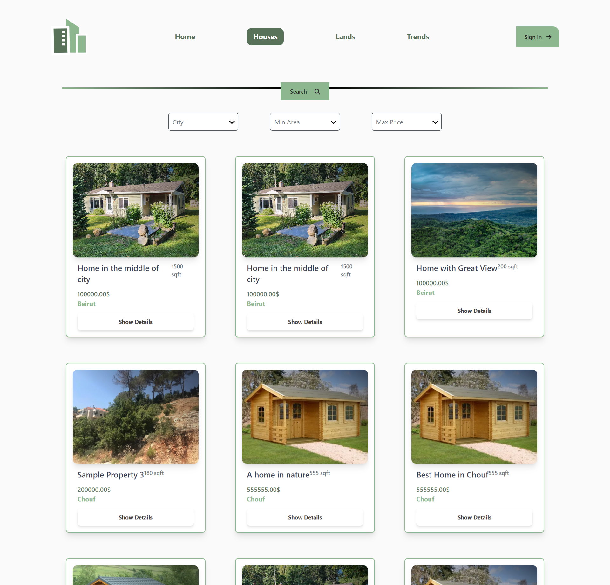

<br><br>

<!-- project philosophy -->


> A website app that serves as a real estate market, making it easier for sellers, buyers and anyone interested in real estate investement to buy, sell and get insights to the Lebanese market.
>
> In addition to the website, a desktop app is designed to give administrators full control over the website and provide in-depth analytics. 
>
> Lebanon Real Estate Insights is your gateway to the Lebanese real estate market. Whether you're looking to buy your dream property, sell your current one, or gain valuable insights into the market trends, we've got you covered. 

### User Stories
- As a user, I want to signup and signin with my google account, so I can easily register and access the website's features.
- As a user, I want to browse property listings with the ability to customize my property search criteria, such as location, price, and property type, so I can narrow down my options to the most suitable properties.
- As a user, I want to post my property on the website and customize the listing details, including property features and photos, to attract potential buyers and showcase my property effectively.
- As a user, I want access to comprehensive market data, including historical price trends, articles, so I get insights to investment in Lebanon.
- As a user, I want the to schedule meetings with sellers or buyers, allowing them to schedule meetings with me.
- As an admin, I want to browse website data and also access comprehensive analytics, so I can manage the website efficiently.

<br><br>

<!-- Prototyping -->


> We designed Lebanon Real Estate Insights using wireframes and mockups, iterating on the design until we reached the ideal layout for easy navigation and a seamless user experience.

### Wireframes
| Landing Page  | Landing Page |  Properties Page |
| ---| ---| ---|
|  |  |  |

### Mockups
| Trends  | Property Details | Dashboard |
| ---| ---| ---|
|  |  |  |

<br><br>

<!-- Implementation -->


> Using the wireframes and mockups as a guide, we implemented the Lebanon Real Estate Insights website with the following features:

### Demo (Web)
| Landing screen  | Properties screen |  
| ---| ---| 
|  |  

### User Screens (Web)
| Landing screen  | Properties screen |  Property screen |
| ---| ---| ---|
|  |  |  |
| Add Property screen  | Property Screen | Trends Screen |
|  |  |  |

### Admin Screens (Desktop App)
| Login screen  | Register screen |  Landing screen |
| ---| ---| ---|
|  |  |  |


<br><br>

<!-- Tech stack -->


###  Lebanon Real Estate Insights is built using the following technologies:

- This project uses the [React Javascript Library](https://react.dev/). 
React is a free and open-source front-end JavaScript library for building user interfaces based on components. It is used to design frontend for apps on mobile, desktop, and the web.
- For persistent data storage (database), the website and admin desktop application use [MySQL](https://www.mysql.com/) to create a structured database schema for efficiently storing and retrieving information related to properties, users, and other data.
- This project uses [Laravel](https://laravel.com), a robust PHP web application framework, as a central component of its architecture. Laravel plays a pivotal role in the project, primarily focusing on the development of robust and secure APIs (Application Programming Interfaces). The github link for the project's backend: https://github.com/Mhmd-Husseini/real-estate-server.git
- This project also uses the [Node.js](https://nodejs.org/en) for building the backend of the admin desktop application. Node.js is an open-source, server-side JavaScript runtime environment that allows for efficient server-side scripting and the development of network applications.
- For the desktop application's frontend, [Electron](https://www.electronjs.org/) is utilized to create a structured database schema for efficiently storing and retrieving information related to properties, users, and other data.

<br><br>

<!-- How to run -->


> To set up Lebanon Real Estate Insights Website locally, follow these steps:

### Prerequisites

Before you begin, ensure you have met the following requirements for the website:
* npm
  ```sh
  npm install npm@latest -g
  ```

### Installation

_Follow these steps to set up the Lebanon Real Estate Insights website (React frontend and Laravel backend)._

1. Open your XAMPP control panel and start Apache and MySQL.
2. Frontend Setup:
   - Clone this repo
   ```sh
   git clone https://github.com/Mhmd-Husseini/real-estate-client.git
   ```
   - Install NPM packages
   ```sh
   npm install
   ```
3. Backend Setup:
   - Clone the backend repo
   ```sh
   git clone https://github.com/Mhmd-Husseini/real-estate-server.git
   ```
   - Install composer packages
   ```sh
   composer install
   ```
4. Add Configuration:
   - Rename .env.example to .env.
   - Add your Google ID and key and specify your database name in the .env file:
   ```sh
   DB_DATABASE=YOUR_DATABASE_NAME
   DB_USERNAME=
   DB_PASSWORD=
   GOOGLE_CLIENT_ID=
   GOOGLE_CLIENT_SECRET=
   GOOGLE_REDIRECT_URI=http://localhost:3000/auth/google
   ```
   - Run the following commands:
   ```sh
   php artisan key:generate
   php artisan key:generate
   php artisan jwt:secret
   ```
5. Start the Website App:
   - Start the Laravel backend server (in the server-laravel directory):
   ```sh
   php artisan serve
     ```
   - Start the React development server for the frontend (in the client directory):
   ```sh
   npm start
     ```
<br><br>
Now, you should be able to run the website locally and explore its features.
